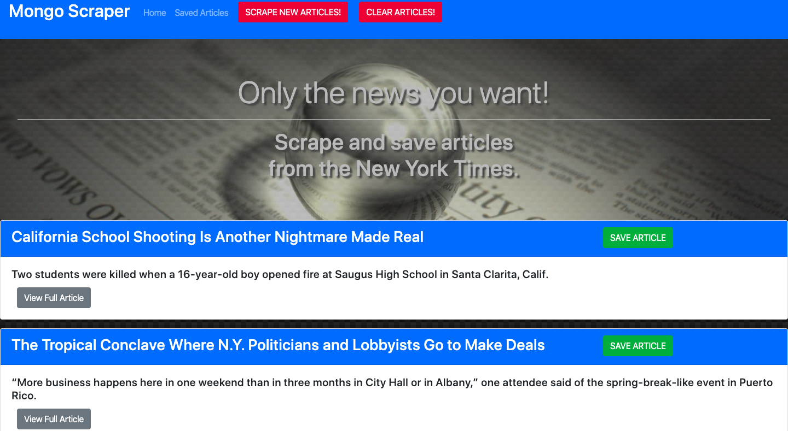
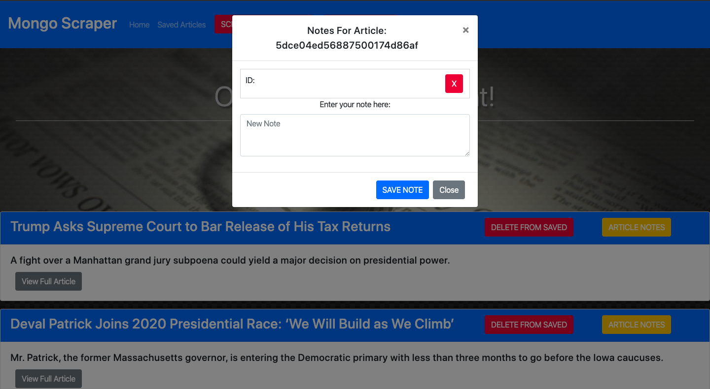

# New York Times News Scraper

As my first foray into scraping and the use of MongoDB, enjoy this application that scrapes new articles from the New York Times website and allows you to save, delete and even make notes for each article of interest.

Any time you wish, just click "Scrape New Articles" at the top of the homepage to see what news is hitting the wire.

You will be provided with a number of headlines.  You can click "View Full Article" to be redirected to the NY Times website, or choose to "Save" the article. Of course, you can clear the results anytime you like from the navigation bar.

Click on "Saved Articles" in the navigation bar to access all of the headlines that you have saved.  From here, you can remove it from your saved list, or click to add a new note about the article (this feature is still in development).

# GitHub Repo:
https://github.com/woodwindscott/news-scraper

# Deployed Site:
https://fathomless-hollows-73497.herokuapp.com/

# Technologies used
This project was created with:
* MongoDB
* Express
* NodeJS
* Handlebars
* HTML
* CSS
* JavaScript
* Bootstrap
* Cheerio (NPM Module)

# Future Development Considerations:
1. The "Add A Note" feature is still buggy. Getting to save a note is functional, but displaying those notes in the context of a non-relational database is not working at the current time.

2. The design could be a little more user-friendly.  Things like a sticky navigation bar come to mind.

3. If I were to completely redesign this application, I would do it as a full MERN stack by using React.
